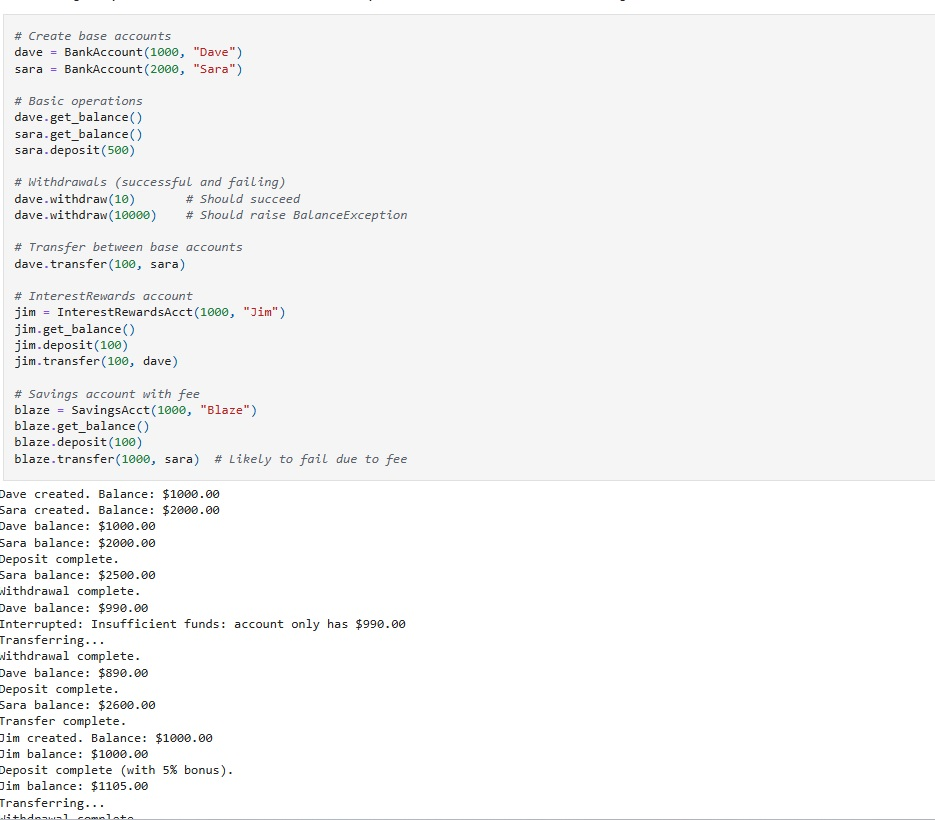
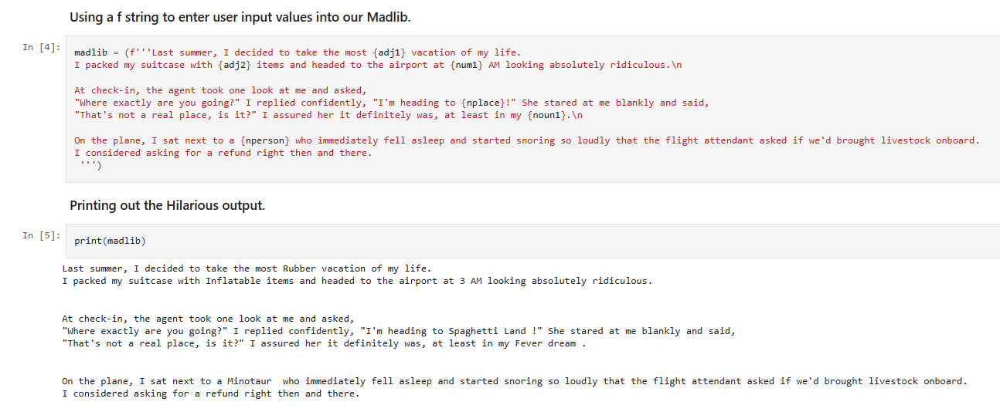
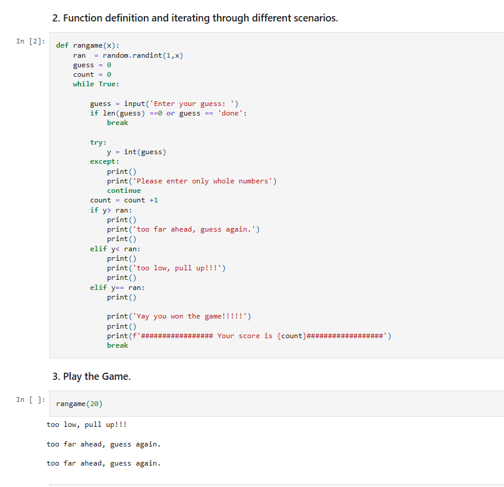
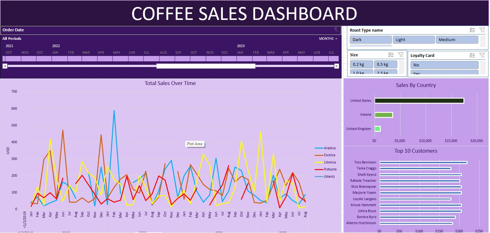
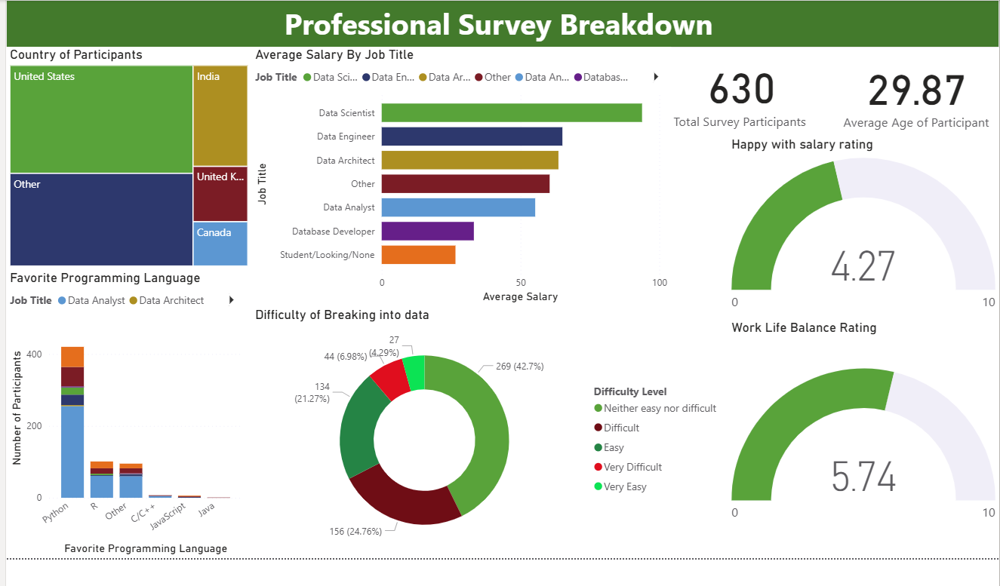
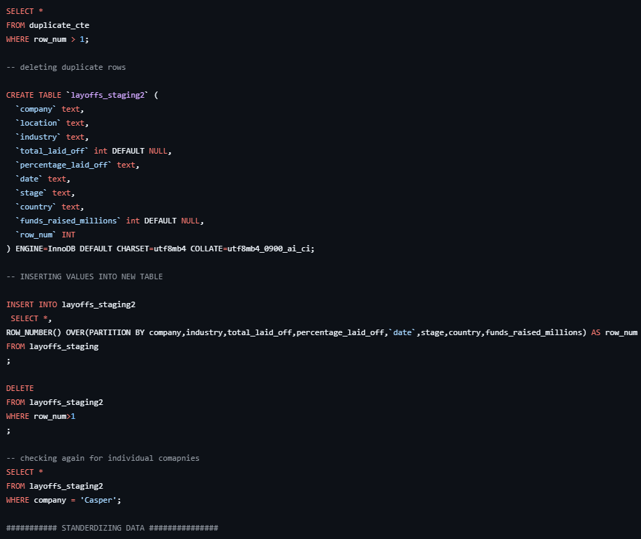
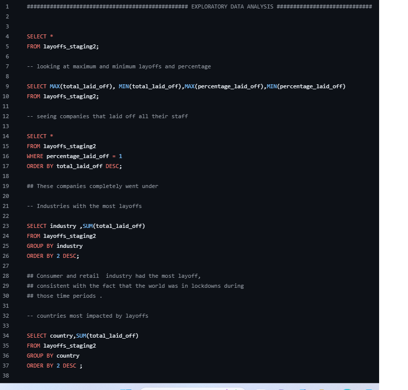

 PORTFOLIO
# Siddhanth Soin | Data Analyst Portfolio

Collection of projects in **Excel**, **Tableau**, **Power BI**, **SQL**, **Python**.

## Featured Projects

| Tool | Project | Link |
|------|---------|------|
| Python | Bank OOP System (Classes/Inheritance) |  |
| Tableau | Steel Production Dashboard | [View](https://public.tableau.com/app/profile/siddhanth.soin/vizzes) |

## Python Code

### Bank Account OOP Class
Object-oriented banking system with deposit/withdraw/transfer + error handling.

### Mad Libs Game
Interactive string formatting game using user input.

### Number Guessing Game
Random number generator + try/except logic.

## Data Analytics

### Coffee Sales Dashboard (Excel)
Sales analysis by type/roast/country/top customers. Pivot tables + KPIs.

[Download](Excel/coffeeOrdersData.xlsx)

### Bike Sales Dashboard (Excel)
Customer demographics, income, commute distance analysis.

### Professional Survey Breakdown (Power BI)
Job titles, languages, difficulty ratings, work-life balance.

### Layoffs Data Cleaning (MYSQL)
Data cleaning prep + analysis of company layoffs.

